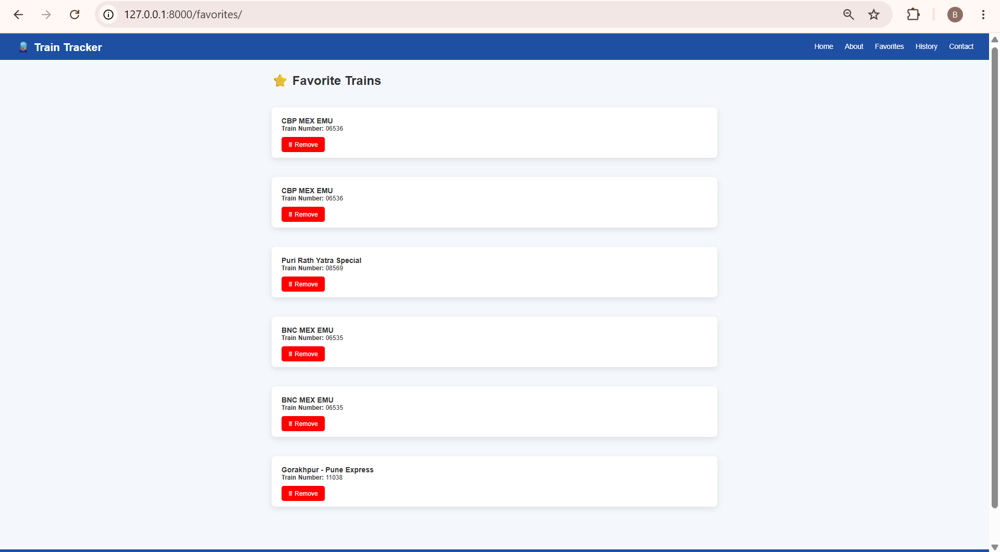
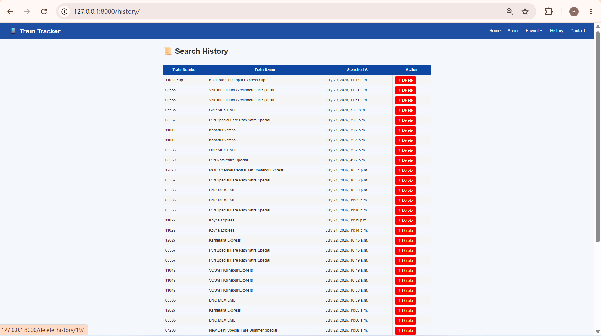
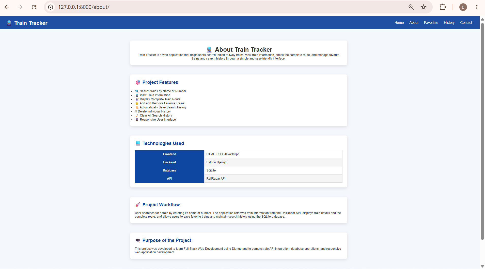

# 🚆 Live Train Status Tracker

A Full Stack Django web application that allows users to search train information, view live train details, manage favorite trains, and maintain search history.

---

## 📌 Features

- 🔍 Search trains by name
- 🚆 View train details
- 📍 Display current train status
- 🛤️ Complete train route
- ⭐ Add trains to Favorites
- ❌ Remove trains from Favorites
- 📜 Search History
- 🗑️ Clear Search History
- 📱 Responsive user interface

---

## 🛠️ Technologies Used

### Frontend
- HTML5
- CSS3
- JavaScript

### Backend
- Python
- Django

### Database
- SQLite3

### Other Tools
- VS Code
- Git
- GitHub

---

## 📂 Project Structure

```
LiveTrainTracker/
│
├── tracker/
│   ├── templates/
│   ├── static/
│   ├── views.py
│   ├── models.py
│   ├── urls.py
│
├── traintracker/
│
├── manage.py
├── db.sqlite3
└── README.md
```

---

## ⚙️ Installation

Clone the repository

```bash
git clone https://github.com/gonuguntlabhavana/LiveTrainTracker.git
```

Go to project folder

```bash
cd LiveTrainTracker
```

Create virtual environment

```bash
python -m venv venv
```

Activate virtual environment

Windows

```bash
venv\Scripts\activate
```

Install dependencies

```bash
pip install django
```

Run migrations

```bash
python manage.py migrate
```

Start the server

```bash
python manage.py runserver
```

Open your browser

```
http://127.0.0.1:8000/
```

---

## 📷 Screenshots

### 🏠 Home Page


---

### 🔍 Search Train


---

### 🚆 Train Details


---

### ⭐ Favorites



---

### 📜 Search History



---

### ℹ️ About Page


---

## 🎯 Future Improvements

- Railway API Integration
- User Authentication
- Live GPS Tracking
- Seat Availability
- PNR Status
- Train Delay Prediction
- Email Notifications

---

## 👩‍💻 Developed By

**Bhavana Gonuguntla**

Python Full Stack Developer

GitHub:
https://github.com/gonuguntlabhavana

LinkedIn:
(Add your LinkedIn Profile Link)

---
